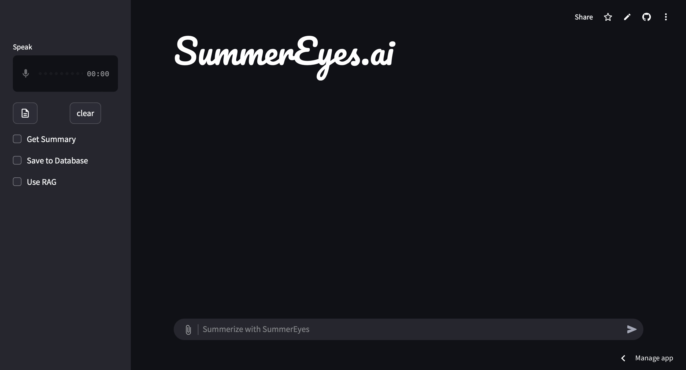
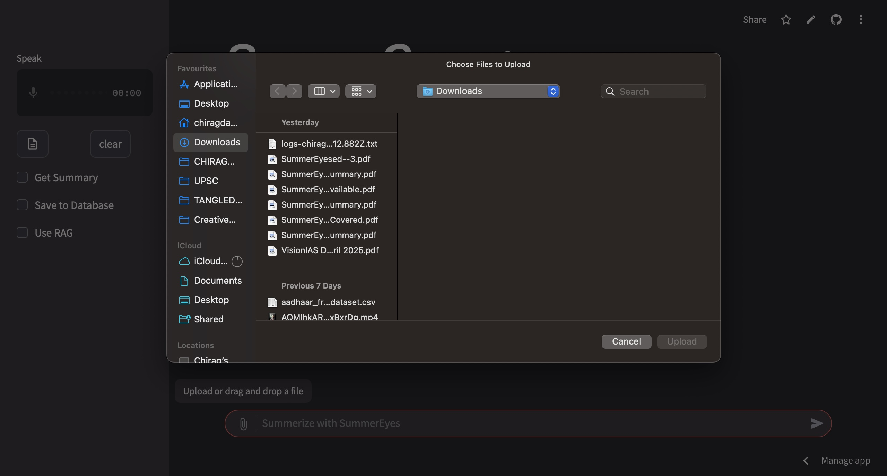
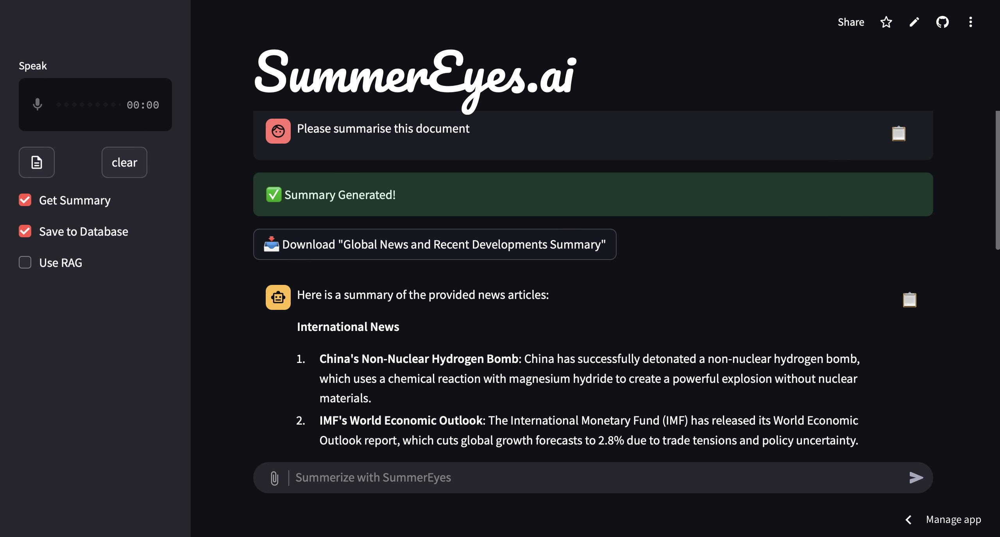
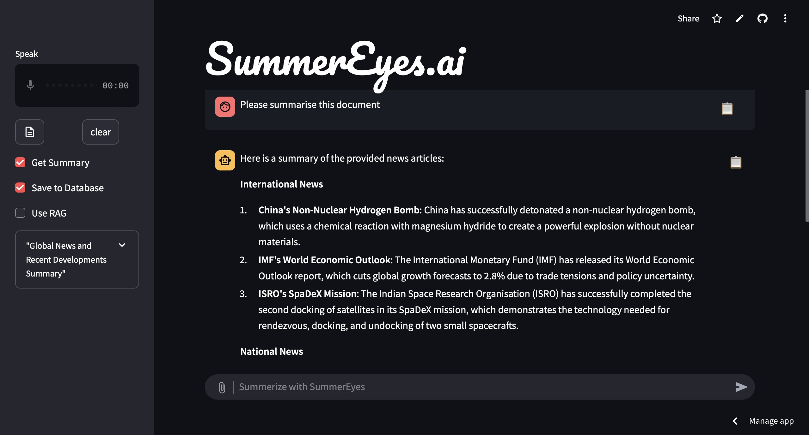
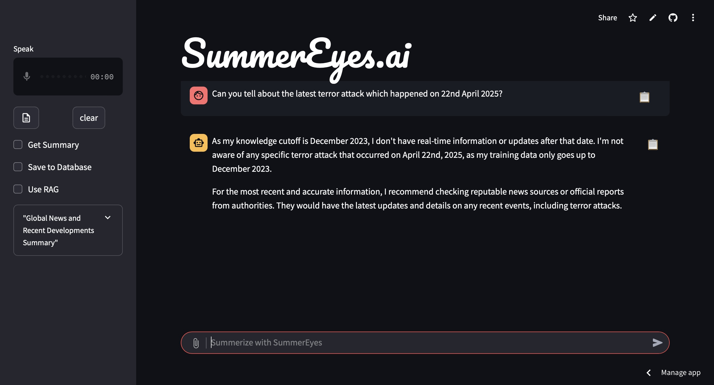
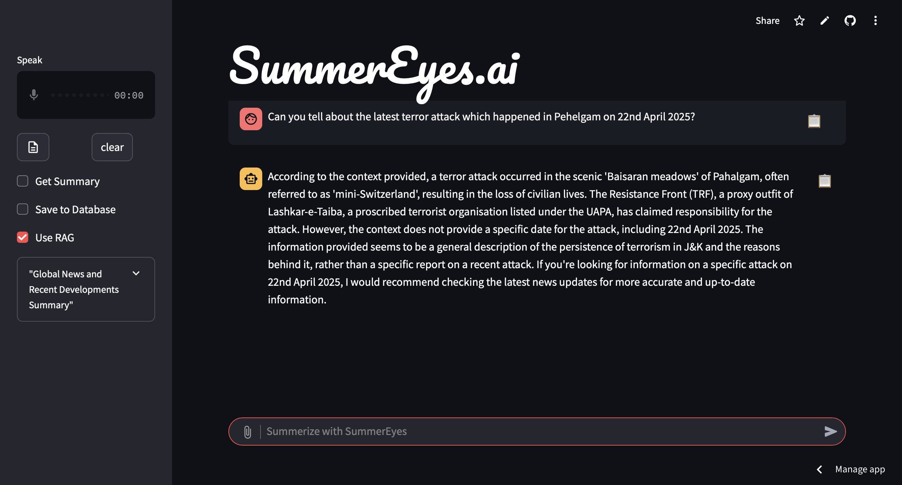
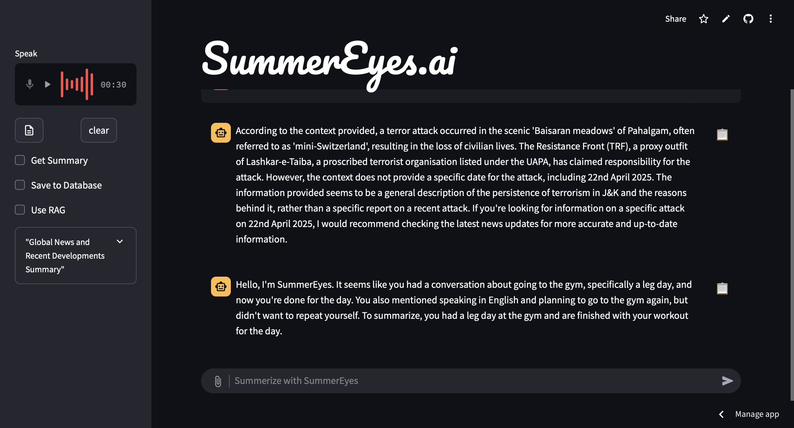
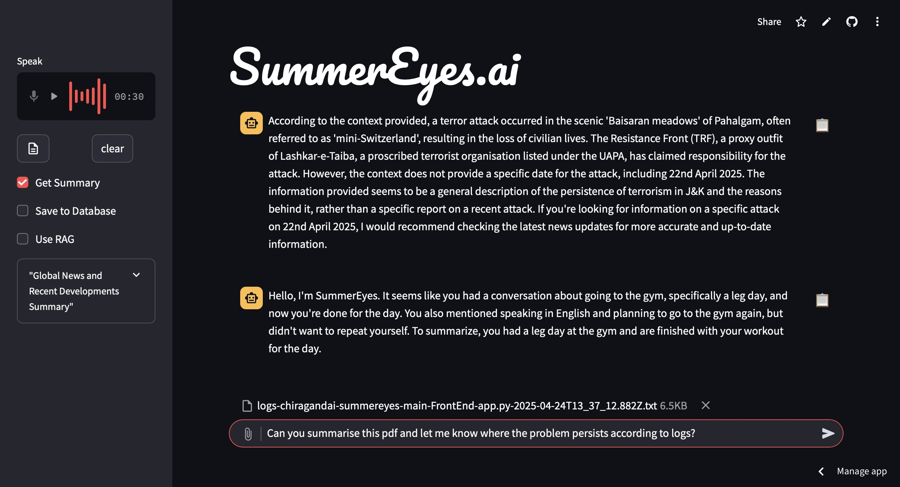
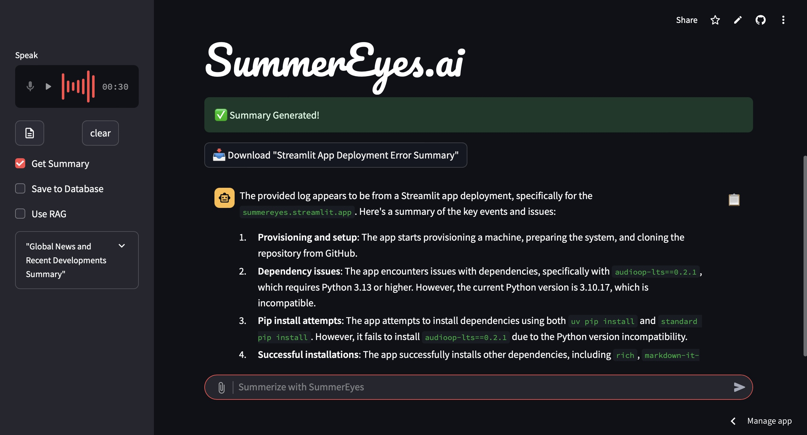

# SummerEyes.ai

**A Summarization Companion Powered by GenAI, RAG, and Voice**

Live Demo: [https://summereyes.streamlit.app](https://summereyes.streamlit.app)

---

## Overview

**SummerEyes.ai** is an intelligent summarization assistant that integrates voice input, Retrieval-Augmented Generation (RAG), and large language models (LLMs) to extract concise insights from audio or text in real time.

Use it to summarize meetings, articles, or spoken thoughts—hands-free and context-aware.

---

## Tech Stack

- Python
- Streamlit (Frontend)
- Whisper (Speech-to-Text)
- LLaMA 4 (LLM)
- LangChain
- Retrieval-Augmented Generation (RAG)
- Deployed on Streamlit Cloud

---

## Features

- **Voice Input**: Speak directly into the app; your speech is transcribed using Whisper.
- **Context-Aware Retrieval**: Relevant context is retrieved based on your input and passed to the language model.
- **LLM Summarization**: Concise and natural summaries generated by LLaMA 4.
- **Minimal UI**: Clean and intuitive user interface built with Streamlit.

---

## Demo

```markdown










